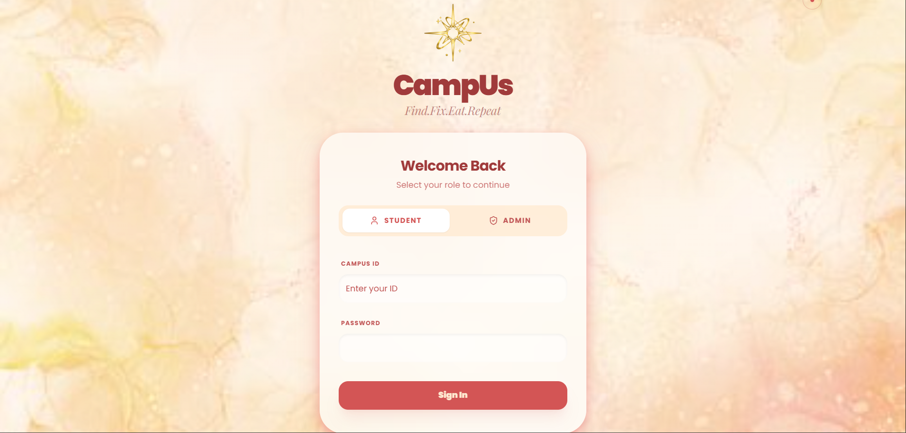
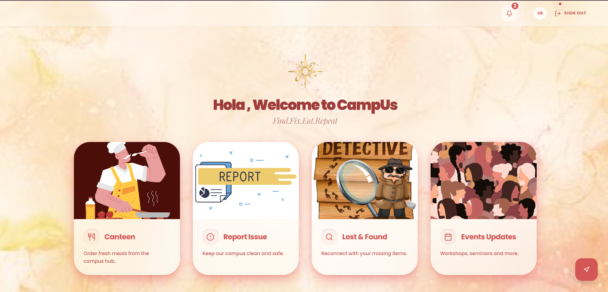
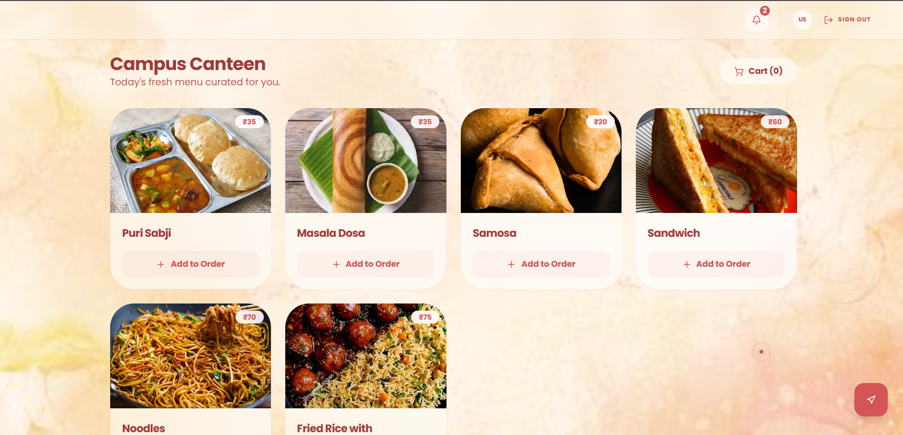
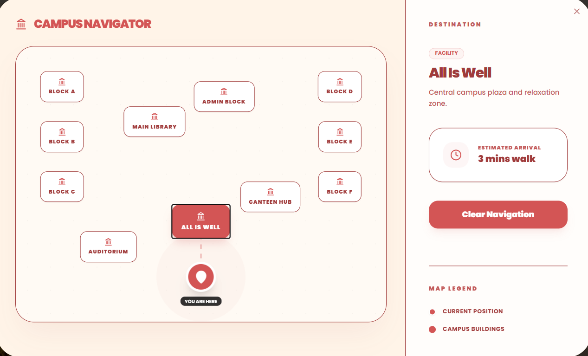

# 🚀 CampUs  
### Smart Campus Services Platform  
### *Find. Eat. Fix. Repeat.*

<p align="center">
  
  
  
  
  
  
</p>

<p align="center">
  <a href="https://YOUR_NETLIFY_LINK" target="_blank">
    🌐 <strong>Live Demo</strong>
  </a>
</p>

<p align="center">
  Transforming everyday campus chaos into a seamless digital ecosystem.
</p>

---

## 📌 Overview

**CampUs** is a unified smart-campus platform built as a solution to the **3rd Problem Statement**, focused on digitizing and optimizing non-academic campus services.

Instead of scattered systems and manual processes, CampUs delivers a centralized, real-time, and role-based ecosystem for students and administrators.

---

## 🚨 The Problem

Campus life includes everyday inefficiencies:

- ⏳ Long canteen queues  
- 📝 Manual issue reporting  
- 🔍 Unorganized lost & found  
- 🎉 Missed department events  
- 🗺️ Confusing campus navigation  

Individually small.  
Collectively disruptive.

---

## 💡 Our Solution — CampUs

A single platform integrating essential campus services:

### 🍽 Smart Canteen
- Live menu display  
- Order tracking  
- Queue optimization  

### 🛠 Issue Reporting System
- Image-based complaint submission  
- Real-time status tracking  
- Admin resolution workflow  

### 🎒 Lost & Found
- Structured posting system  
- Admin moderation  
- Organized listings  

### 🎉 Event Discovery
- Department-wise push notifications  
- Real-time workshop & fest alerts  

### 📍 Interactive Campus Map
- “You Are Here” live indicator  
- Pathfinding to any building  
- Easy navigation assistance  

---

## 🛠 Tech Stack

| Layer        | Technology |
|-------------|------------|
| Frontend    | Next.js + React.js |
| Styling     | Tailwind CSS |
| Backend     | Firebase |
| Database    | Firestore |
| Authentication | Firebase Auth |
| Hosting     | Netlify |

Designed for scalability, performance, and real-time updates.

---

## 🔐 Role-Based Architecture

CampUs implements structured access control:

### 👤 User
- Access services  
- Submit requests  
- Track issue status  

### 🛡️ Admin
- Manage issues  
- Moderate lost & found  
- Publish events  
- Control system workflows  

Ensuring secure and organized campus operations.

---

## 🌟 Unique Selling Points

- ✅ Unified all-in-one campus services  
- ⚡ Real-time updates & notifications  
- 🔐 Secure role-based access  
- 🎨 Modern, intuitive UI/UX  
- ☁️ Cloud-backed scalable architecture  

---

## 🌐 Live Deployment

CampUs is fully deployed and accessible online:

🔗 https://campus-codebeasts.netlify.app/
Experience the smart campus ecosystem in real time.

---

## 📂 Project Structure

```bash
CampUs/
│── src/
│── public/
│── package.json
│── next.config.ts
│── tailwind.config.ts
│── tsconfig.json
│── README.md
```

---

## 📸 Screenshots

> Add images inside a `/screenshots` folder

```markdown




```

---

## 🚀 Future Enhancements

- 🤖 AI-powered campus assistant  
- 📊 Admin analytics dashboard  
- 💳 Payment gateway integration  
- 📲 QR-based canteen pickup  
- LMS integration  

CampUs is designed to evolve with the campus.

---

## 👥 Team

**Code Beasts**  
Building smarter digital ecosystems for modern campuses.

---

## 📬 Contact

For queries or collaboration:

📧 Your Email  
🔗 GitHub: https://github.com/nikitaMishr  

---

<p align="center">
  Built with ❤️ to simplify campus life.
</p>